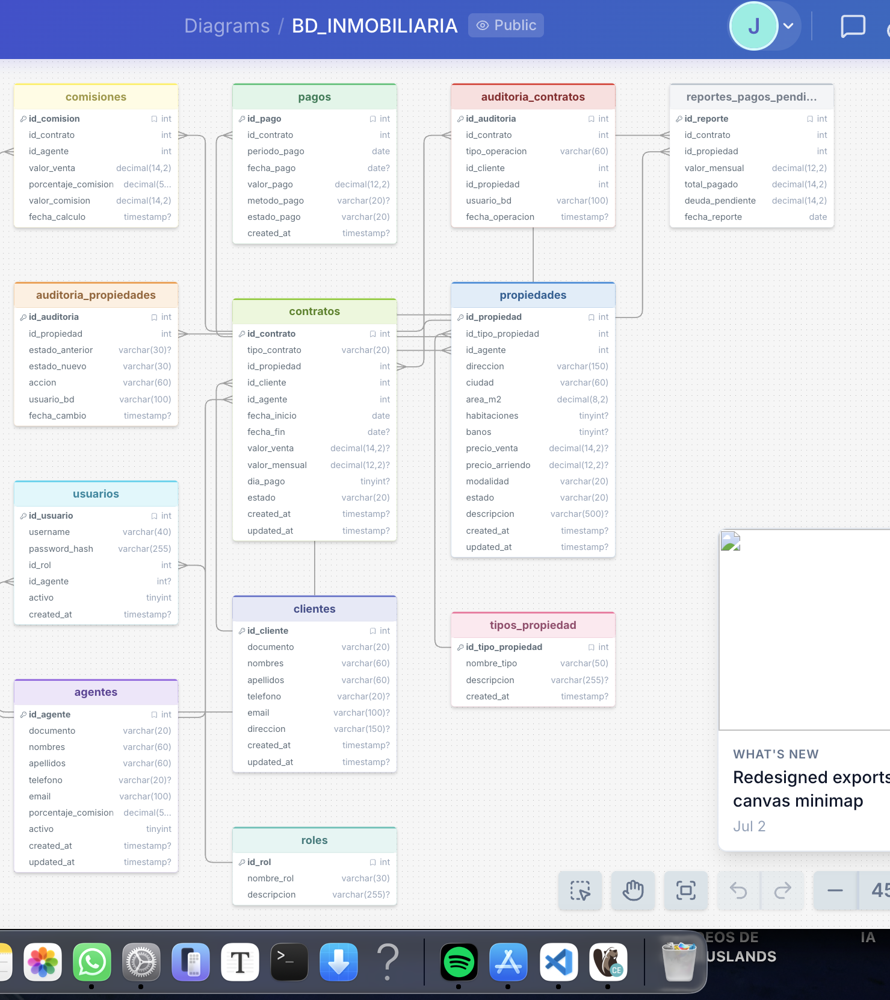

# Sistema de Gestión Inmobiliaria — MySQL

## Descripción

Proyecto académico completo de base de datos relacional para una **inmobiliaria**, desarrollado en **MySQL 8.0+**. Permite administrar propiedades (casas, apartamentos y locales comerciales), clientes, agentes, contratos de compraventa y arrendamiento, historial de pagos, comisiones, auditoría de cambios, reportes automáticos de cartera pendiente y control de acceso por roles.

El proyecto está normalizado hasta **Tercera Forma Normal (3FN)**, incluye funciones almacenadas, triggers de auditoría, un evento programado mensual, índices de optimización y un esquema de seguridad basado en roles de MySQL.

## Tecnologías

- MySQL 8.0+
- SQL estándar (DDL, DML, funciones, triggers, eventos)
- Mermaid (diagrama entidad-relación)

## Características

- **Propiedades**: inventario con tipo, modalidad (venta / arriendo / ambas) y estado (`DISPONIBLE`, `ARRENDADA`, `VENDIDA`, `NO_DISPONIBLE`).
- **Clientes y agentes**: gestión independiente, sin datos duplicados en otras tablas.
- **Contratos**: de venta o arrendamiento, con restricciones que impiden combinaciones inválidas de valores.
- **Pagos**: historial por periodo, con estados `PAGADO`, `PENDIENTE`, `VENCIDO`.
- **Comisiones**: cálculo automático mediante función `calcular_comision_venta()`.
- **Auditoría**: registro automático (triggers) de cambios de estado de propiedades y de nuevos contratos.
- **Seguridad**: tres roles de MySQL (`ADMINISTRADOR`, `AGENTE`, `CONTADOR`) con privilegios diferenciados.
- **Optimización**: índices para las consultas más frecuentes, verificados con `EXPLAIN`.
- **Eventos automáticos**: reporte mensual de deuda pendiente por contrato de arriendo.

## Modelo de datos

El diagrama entidad-relación completo, con el detalle de cada tabla y la explicación de la normalización, está en [https://drawsql.app/teams/julieth/diagrams/bd-inmobiliaria],[]

## Normalización

- **1FN**: todos los campos son atómicos; `modalidad` y `estado` se modelan como `ENUM` de un único valor.
- **2FN**: todas las tablas usan clave primaria simple (`AUTO_INCREMENT`), sin dependencias parciales.
- **3FN**: se separaron en tablas independientes los datos que no dependen directamente de la clave primaria de origen — el tipo de propiedad, los datos del agente y el nombre del rol nunca se repiten dentro de `propiedades`, `contratos` o `usuarios`. El detalle completo está en `docs/modelo_er.md`.

## Estructura del proyecto

```
inmobiliaria-mysql/
│
├── README.md
│
├── sql/
│   ├── 01_schema.sql        -- Creación de la base de datos y tablas
│   ├── 02_data.sql          -- Datos de prueba
│   ├── 03_functions.sql     -- Funciones almacenadas
│   ├── 04_triggers.sql      -- Triggers de auditoría
│   ├── 05_security.sql      -- Roles y privilegios
│   ├── 06_optimization.sql  -- Índices y consultas con EXPLAIN
│   ├── 07_events.sql        -- Evento programado mensual
│   └── 08_queries.sql       -- Consultas de ejemplo
│
└── docs/
    └── modelo_er.md         -- Modelo entidad-relación y normalización
```


## Ejemplos de uso

**Consultar propiedades disponibles:**
```sql
SELECT p.direccion, t.nombre_tipo, p.precio_venta
FROM propiedades p
JOIN tipos_propiedad t ON t.id_tipo_propiedad = p.id_tipo_propiedad
WHERE p.estado = 'DISPONIBLE';
```

**Calcular una comisión:**
```sql
SELECT calcular_comision_venta(300000000.00, 3.00) AS comision; -- 9000000.00
```

**Consultar deuda de un contrato:**
```sql
SELECT calcular_deuda_pendiente(2) AS deuda_pendiente;
```

**Registrar un nuevo contrato** (dispara automáticamente los triggers de auditoría y actualización de estado):
```sql
INSERT INTO contratos (tipo_contrato, id_propiedad, id_cliente, id_agente, fecha_inicio, valor_mensual, dia_pago, estado)
VALUES ('ARRIENDO', 6, 3, 1, CURDATE(), 1450000.00, 10, 'ACTIVO');
```

**Registrar un pago:**
```sql
INSERT INTO pagos (id_contrato, periodo_pago, fecha_pago, valor_pago, metodo_pago, estado_pago)
VALUES (2, '2026-09-01', CURDATE(), 2200000.00, 'TRANSFERENCIA', 'PAGADO');
```

**Consultar auditoría de propiedades:**
```sql
SELECT * FROM auditoria_propiedades ORDER BY fecha_cambio DESC;
```

**Consultar reportes de pagos pendientes generados por el evento:**
```sql
SELECT * FROM reportes_pagos_pendientes ORDER BY fecha_reporte DESC;
```

## Seguridad

Tres roles de MySQL, definidos en `sql/05_security.sql`:

| Rol | Puede | No puede |
|---|---|---|
| **ADMINISTRADOR** | Control total sobre `inmobiliaria_db`: DML, DDL, rutinas, triggers, eventos y vistas | — |
| **AGENTE** | Consultar propiedades/clientes/agentes, registrar clientes, actualizar campos puntuales de propiedades, registrar contratos, consultar pagos y comisiones | Eliminar registros críticos, administrar usuarios o roles |
| **CONTADOR** | Consultar contratos/propiedades/clientes/agentes, consultar y registrar pagos, consultar comisiones y reportes de deuda | Modificar propiedades, administrar usuarios o roles |

Las contraseñas incluidas en el script son **ficticias**, marcadas explícitamente como datos de prueba (`ClaveDemo_...`). En un entorno real deben generarse credenciales seguras y gestionarse fuera del control de versiones.

## Optimización

Índices creados en `sql/06_optimization.sql`, con su justificación:

- `idx_propiedades_estado` — filtro más frecuente del negocio (propiedades disponibles).
- `idx_propiedades_tipo_estado` — consultas de disponibilidad por tipo de propiedad.
- `idx_contratos_estado` / `idx_contratos_tipo_estado` — reportes y validaciones sobre contratos activos por tipo.
- `idx_pagos_contrato_estado` — soporta `calcular_deuda_pendiente()` y reportes de cartera.
- `idx_pagos_periodo` — reportes mensuales por periodo de pago.

Cada índice fue verificado con `EXPLAIN`, confirmando que MySQL los utiliza (columna `key` distinta de `NULL`, `type` en `ref`/`range` en lugar de `ALL`).

## Eventos

El evento `generar_reporte_pagos_pendientes` (en `sql/07_events.sql`) se ejecuta automáticamente **una vez al mes** y guarda, para cada contrato de arriendo activo, el valor mensual, el total pagado y la deuda pendiente en `reportes_pagos_pendientes`.

Requiere que el planificador de eventos esté activo:
```sql
SET GLOBAL event_scheduler = ON;
SHOW EVENTS FROM inmobiliaria_db;
```

Para pruebas inmediatas, sin esperar un mes, el mismo archivo incluye el procedimiento `sp_generar_reporte_pagos_pendientes()`, que ejecuta la misma lógica bajo demanda:
```sql
CALL sp_generar_reporte_pagos_pendientes();
SELECT * FROM reportes_pagos_pendientes;
```

## Pruebas realizadas

Todos los scripts fueron ejecutados de principio a fin contra un motor MySQL/MariaDB real, en el orden documentado, sin errores de sintaxis ni de integridad referencial. Resultados verificados:

1. **Comisión de venta**: `calcular_comision_venta(620000000.00, 2.50)` → `15500000.00` (contrato 1, agente con 2.5 % de comisión). ✔
2. **Deuda pendiente**:
   - Contrato 2 (arriendo, 1 pago pendiente de $2.200.000) → deuda `2200000.00`. ✔
   - Contrato 3 (arriendo, 1 pago vencido + 2 pendientes de $1.200.000) → deuda `3600000.00`. ✔
3. **Trigger de auditoría de propiedades**: al insertar un contrato nuevo (`ARRIENDO`/`VENTA`), el trigger `trg_propiedades_estado_por_contrato` actualiza el estado de la propiedad, lo que dispara `trg_propiedades_auditoria_estado` y deja constancia en `auditoria_propiedades` con `estado_anterior`, `estado_nuevo`, `usuario_bd` y `fecha_cambio`. ✔
4. **Trigger de auditoría de contratos**: cada `INSERT INTO contratos` genera automáticamente una fila en `auditoria_contratos`. ✔
5. **Evento mensual**: `CALL sp_generar_reporte_pagos_pendientes()` insertó correctamente un reporte por cada contrato de arriendo activo, con la deuda calculada por `calcular_deuda_pendiente()`. ✔
6. **Índices**: las 5 consultas de `06_optimization.sql` fueron verificadas con `EXPLAIN`, confirmando el uso de los índices creados (`idx_propiedades_tipo_estado`, `idx_contratos_estado`, `idx_pagos_contrato_estado`, `idx_pagos_periodo`, índice de la FK `id_agente`). ✔
7. **Consultas de ejemplo**: las 19 consultas de `08_queries.sql` (JOIN, GROUP BY, HAVING, ORDER BY, subconsultas con `EXISTS`, funciones personalizadas y agregaciones) se ejecutaron correctamente sobre los datos de prueba. ✔

Para reproducir la verificación del trigger de estado manualmente:
```sql
UPDATE propiedades SET estado = 'ARRENDADA' WHERE id_propiedad = 6 AND estado = 'DISPONIBLE';
SELECT * FROM auditoria_propiedades WHERE id_propiedad = 6 ORDER BY fecha_cambio DESC;
```
